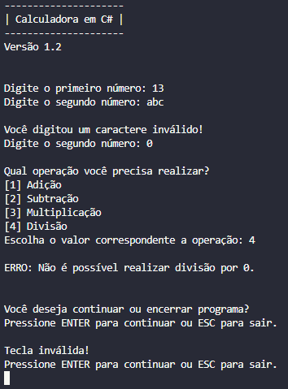

# Calculadora em C# (CSharp)
Repositório onde irei atualizar o meu projeto de calculadora em C# conforme eu for evoluindo nos estudos da linguagem.  
Por enquanto estou programando um aplicativo de console, a intenção é ir evoluindo nos estudos até aprender a criar uma calculadora completa e executável .exe.  
O repositório servirá como linha do tempo para mostrar o meu progresso de estudo e aprendizagem até atingir o objetivo final.


## Tecnologias

As tecnologias que eu estou usando para desenvolver a calculadora são:
- Linguagem de programação: C# (CSharp);
- Ambiente de desenvolvimento: Visual Studio Code;
- Framework: .NET;


## Como executar

- Clone este repositório: `git clone https://github.com/Lucas-Efraim/Calculadora-em-CSharp`
- Acesse a pasta do projeto: `cd Calculadora-em-CSharp`
- Execute o projeto: `dotnet run`


##  Versão 1.0 - Dia 15/03/2026

Esta é a primeira versão da calculadora, bem simples, funcionando as quatro operações básicas (adição, subtração, multiplicação e divisão).
- Verificação de divisão por zero está ok;
- Verificação de operação inválida está ok;


### Imagens do projeto

 


### Planos para a próxima versão

Na próxima versão eu vou estudar como implementar um loop para o usuário continuar usando a calculadora até ele decidir fechar o programa, em vez do programa terminar a cada cálculo realizado.  
Também quero aprender a como evitar do programa crashar se o usuário digitar letras em vez de números:


---  
---


## Versão 1.1 - Dia 16/03/2026

### Notas da atualização

- Atualização no código fonte do projeto;
    - Substituição dos `if / else if / else` do menu de operação por `switch`.
- Tratamento de erro realizado com sucesso;
    - implementei a função `TryParse` no lugar de `Parse` para converter as `strings` em números, desta forma, o programa não fecha caso a conversão falhe quando o usuário digitar letras em vez de números.
    - Implementei o seguinte código para evitar que o programa continue mesmo com erro de conversão _**Texto / Número**_:
    ```
    bool operacaoValida = int.TryParse(Console.ReadLine(), out int operacao);
        if (!operacaoValida)
        {
            Console.WriteLine("ERRO: Você digitou um caractere inválido!");
            Console.WriteLine("Encerrando o programa...");
            return;
        }
    ```


### Planos para a próxima versão

Ainda estou estudando sobre a implementação do loop, então irei adicionar na próxima versão.  
Também irei adicionar um loop na situação onde caso o usuário digite uma letra, o programa avisa o erro e solicita a entrada novamente em vez de fechar.


---
---


## Versão 1.2 - Dia 19/03/2026

Esta é a versão mais complexa até o momento. Levei cerca de 3 dias estudando para compreender melhor os conceitos de `while` e conseguir aplicá-lo corretamente no loop principal do programa.

Além disso, também estudei o funcionamento de `ConsoleKeyInfo` e seus atributos, utilizando essa estrutura em conjunto com o `while` para controlar o fluxo do programa. Agora o usuário pode decidir se deseja continuar usando a calculadora pressionando **ENTER** ou encerrar o programa pressionando **ESC**.

Também alterei o comportamento da divisão por zero: anteriormente o programa era encerrado, e agora apenas exibe a mensagem de erro e segue normalmente para a opção de continuar ou sair.

Foram realizadas ainda algumas melhorias na experiência do usuário (UX), como:
- Adição de espaçamentos para melhor leitura;
- Padronização da exibição dos resultados;
- Limpeza da tela ao reiniciar o programa utilizando `Console.Clear()`;


### Notas da atualização

- Implementação de loop com `while` para manter o programa em execução contínua;
- Validação da operação escolhida, garantindo entrada apenas entre 1 e 4;
- Controle de fluxo com teclado (`ConsoleKeyInfo` + `while`), permitindo:
    - **ENTER** para continuar.
    - **ESC** para sair.
- Melhorias de UX/UI para tornar o uso mais claro e organizado;




### Planos para a próxima versão

- Usar métodos para separar algumas partes que estão repetitivas;
- Melhorar a organização e legibilidade do código;
- Continuar aprimorando a experiência do usuário (UX/UI);