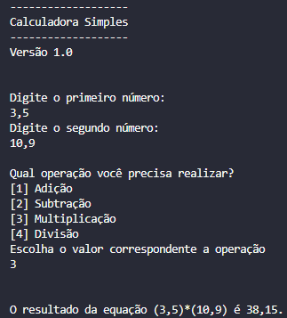
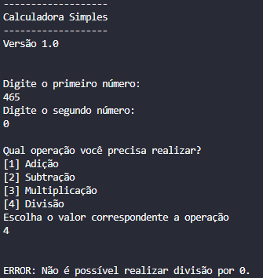
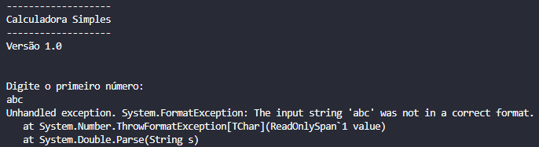

# Calculadora em C# (CSharp)
Repositório onde irei atualizar o meu projeto de calculadora em C# conforme eu for evoluindo nos estudos da linguagem.  
Por enquanto estou programando um aplicativo de console, a intenção é ir evoluindo nos estudos até aprender a criar uma calculadora completa e executável .exe.  
O repositório servirá como linha do tempo para mostrar o meu progresso de estudo e aprendizagem até atingir o objetivo final.


## Tecnologias

As tecnologias que eu estou usando para desenvolver a calculadora são:
- Linguagem de programação: C# (CSharp);
- Ambiente de desenvolvimento: Visual Studio Code;
- Framework: .NET;


##  Versão 1.0 - Dia 14/03/2026

Esta é a primeira versão da calculadora, bem simples, funcionando as quatro operações básicas (adição, subtração, multiplicação e divisão).
- Verificação de divisão por zero está ok;
- Verificação de operação inválida está ok;


### Imagens do projeto

 


### Planos para a próxima versão

Na próxima versão eu vou estudar como implementar um loop para o usuário continuar usando a calculadora até ele decidir fechar o programa, em vez do programa terminar a cada cálculo realizado.  
Também quero aprender a como evitar do programa crashar se o usuário digitar letras em vez de números:




---  
---
---


## Versão 1.1 - Dia 15/03/2026

### Notas da atualização

- Atualização no código fonte do projeto;
    - Substituição dos `if / else if / else` do menu de operação por `switch`.
- Tratamento de erro realizado com sucesso;
    - implementei a função `TryParse` no lugar de `Parse` para converter as `strings` em números, desta forma, o programa não fecha caso a conversão falhe quando o usuário digitar letras em vez de números.
    - Implementei o seguinte código para evitar que o programa continue mesmo com erro de conversão _**Texto / Número**_:
    ```
    bool operacaoValida = int.TryParse(Console.ReadLine(), out int operacao);
        if (!operacaoValida)
        {
            Console.WriteLine("ERRO: Você digitou um caractere inválido!");
            Console.WriteLine("Encerrando o programa...");
            return;
        }
    ```


### Planos para a próxima versão

Ainda estou estudando sobre a implementação do loop, então irei adicionar na próxima versão.  
Também irei adicionar um loop na situação onde caso o usuário digite uma letra, o programa avisa o erro e solicita a entrada novamente em vez de fechar.